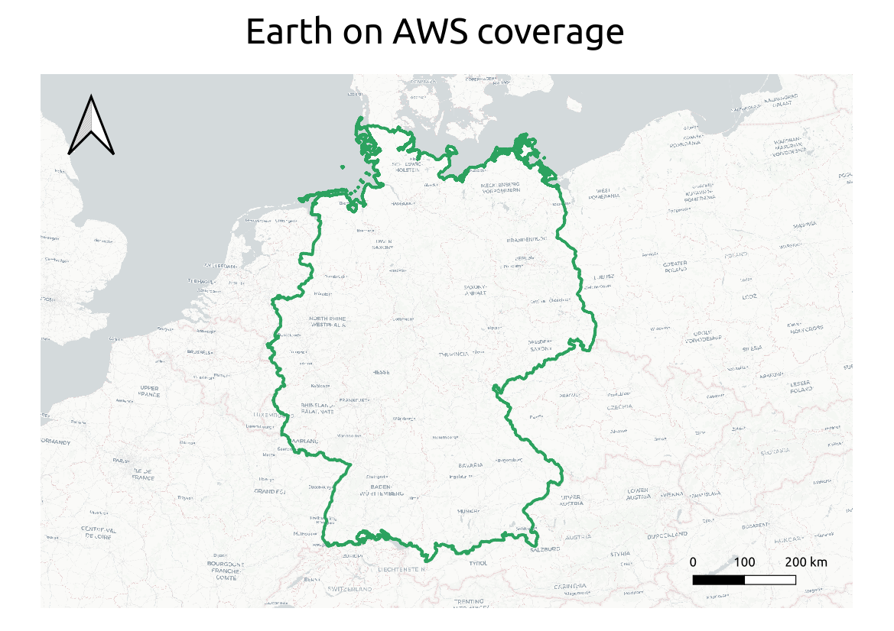

# earth-on-aws

Synthetic Aperture Radar (SAR) is an active remote sensing technique, where electromagnetic pulses are emitted and received by an antenna. The Sentinel-1 satellite mission consists of two identical satellites, Sentinel-1A and Sentinel-1B, launched by the European Space Agency (ESA) in 03 April 2014 and 25 April 2016 respectively (ESA, 2021a). These satellites orbit the Earth while acquiring SAR images at a wave frequency of 5.405GHz (C-band). This mission exploits the usage of 2 satellites in order to have a fast revisit time (12 days and down to 6 days in some areas).The main applications of the Sentinel-1 SAR images are the monitoring of land use changes and surface deformation along with support for emergency management. Further applications include but are not limited to monitoring of sea ice, icebergs, land ice, inland waters, oil spills, ships, and others (ESA, 2021a).

The Sentinel-1 SLC IW image collection comes as a packed format that must be entirely downloaded in order to be used. This dataset allows the access to parts of the data that is needed for a given study area, thus minimizing the storage and downloading time requirements of a project. This dataset could also be included as a datasource for applications that can make direct use of objects within the S3 bucket without downloading the files.

ESA. (2021a). About copernicus sentinel-1. https://sentinel.esa.int/documents/247904/4603794/Sentinel-1-infographic.pdf 