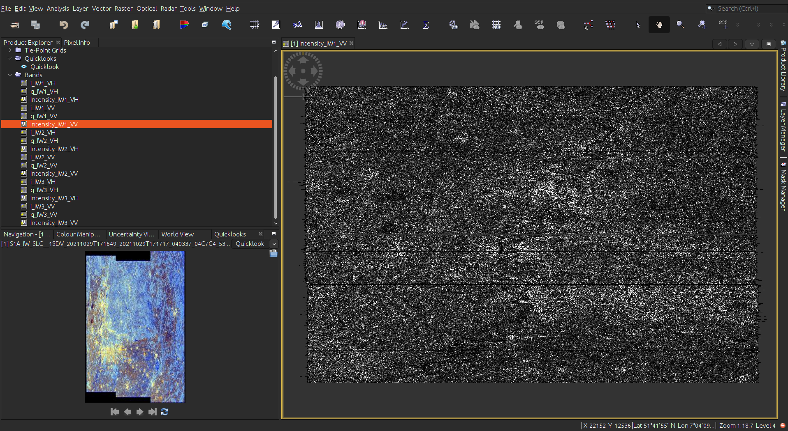
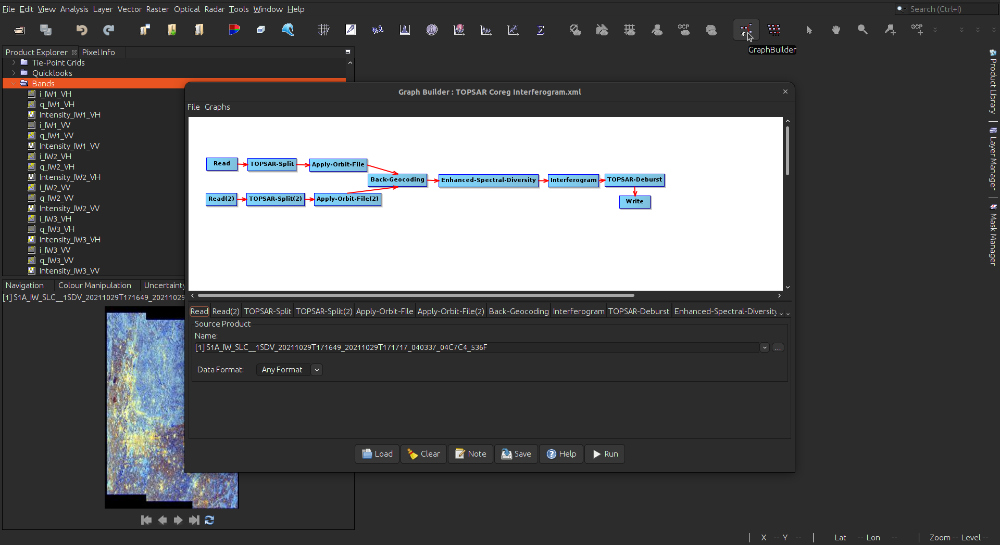
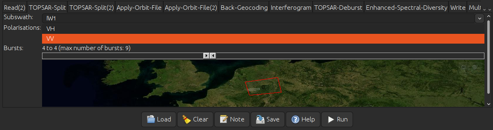
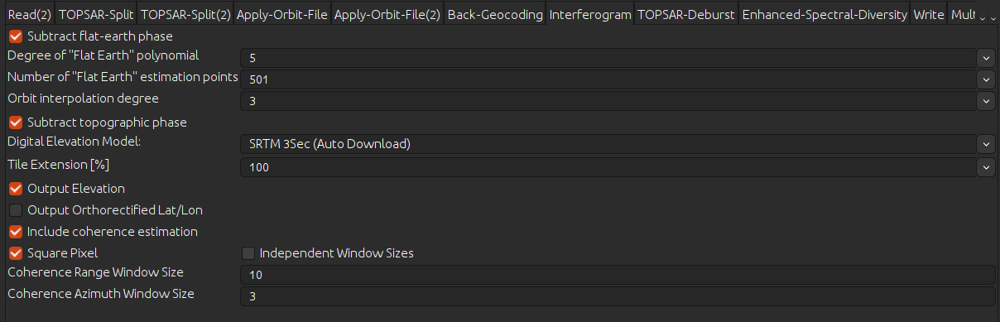
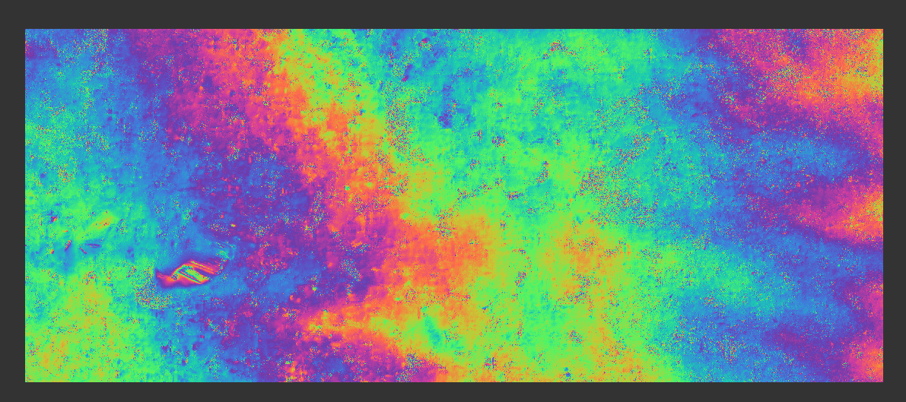
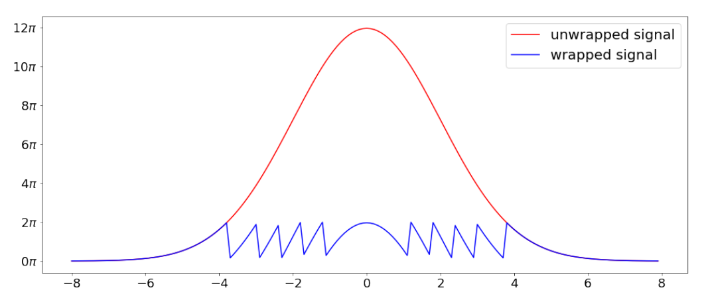
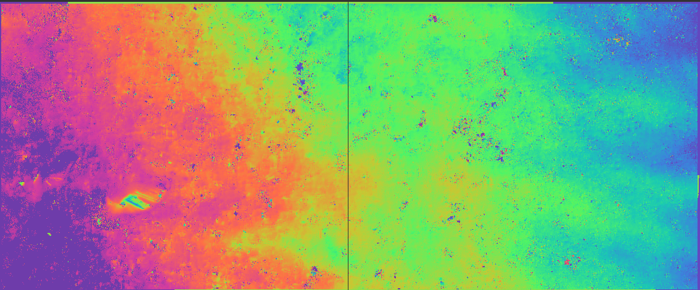
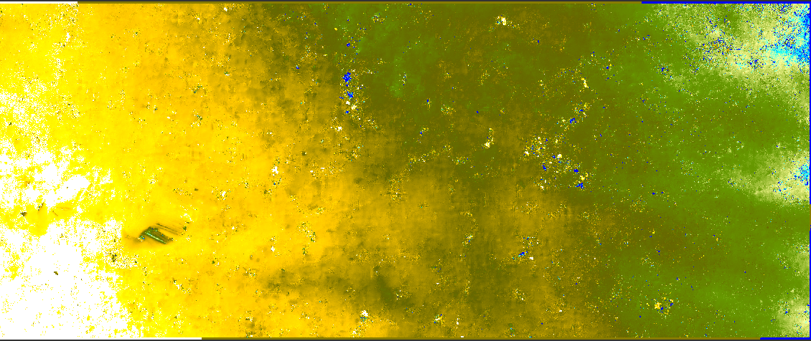

The Earth on AWS project provides Synthetic Aperture Radar (SAR) data from the Sentinel-1 mission in the Single-Look Complex (SLC) format in an uncompressed way. After the retrieval of the scenes from the S3 bucket, the user may proceed with the processing of them to create insightful products such as deformation maps in this case.

## Background

### Interferometric synthetic aperture radar

SAR imagery in the SLC format contains information not only about the amplitude of the backscattered signals, but also the phase at the same time, this can be interpreted as the distance between a target on the ground and the sensor. This information can be further explored with the interferometric synthetic aperture radar (InSAR) technique for ground deforamtion analysis. In a broad sense, InSAR calculates the difference in phase between two acquisitions separate in time to estimate the changes in the earth surface in reference to the satellite.

### Software
There are a variety of software packages capable of managing SAR data and calculating interferograms and displacement maps both in the open source and the private scene. In this case, the software [SNAP](https://step.esa.int/main/download/snap-download/)  from the European Space Agency (ESA) will be used thanks to its user-friendly interface, great utilities with the Sentinel-1 SAR imagery and compatibility with the most common operating systems.

### Doing interferometry
In this tutorial a [recipe](./recipes/Sentinel_1_Interferogram_formation.xml) was prepared, so the user can get an easy first experience with the technique. The same result can also be achieved by executing each step separately as well and also all intermediate steps can be saved.

The Sentinel-1 SLC images used in this tutorial are:
- S1A_IW_SLC__1SDV_20211029T171649_20211029T171717_040337_04C7C4_536F.SAFE
- S1A_IW_SLC__1SDV_20211110T171649_20211110T171717_040512_04CDE4_8F7D.SAFE

### Loading the imagery
First, you will need to load the 2 images that will feed the interferogram calculation. You can load imagery by following menu `File > Open Product` or by dragging the imagery folders (denoted by ending in `.SAFE`) into the Product explorer tab. From here you can explore the scenes and see the different components in the raw imaginary datatype as well as the calculated intensity.

### Loading the InSAR recipe
By clicking the Graph builder button, you can access a tool that executes preconfigured routines. From here you can load the recipe provided in this tutorial and proceed with tuning the parameters according to your use case. For the next steps you will see how to configure the recipe for your use case. The first part is to select your images in the read steps.

1. TopSAR split

The very first step of processing consists in selecting the right portion of the image to be processed. This will vary according to your needs and the Area of Interest of your project. You can do this by selecting one of the three main divisions (Swaths) and then using the slider to select the right subdivisions (Bursts). Check if the VV polarisation is selected and provide the same parameters in the split of your second image

2. Apply orbit file

For step you can leave the default setup which will make sure that your images will have access to the best orbit parameters possible. This step will allow you to have a good comparison between both images and a proper geocoding.

3. Image alignment (Coregistration)

The following steps (Back-Geocoding and Enhanced-Spectral-Diversity) will allow you to stack both images with sub-pixel accuracy. The back-geocoding makes use of an external digital elevation model (DEM). you can either use the Auto Download options or you can use another one that you might have. As for the rest of parameters, the default values provide good results.

4. Interferogram (IFG) formation

In this stage the phase difference is calculated. With the parameters given in this recipe, the resulting interferogram will have information about the phase associated with the deformation and the one related to topography and the earth’s shape will be removed. The output also contains a layer for the coherence, this is proxy to the Signal to Noise ratio of the results.

Interferograms in this stage still cannot be easily interpreted because they contain data in the range [-pi, pi] and they appear in a “wrapped format”.

5. Deburst

In the Sentinel-1 SLC images, the acquisition is done with bursts that need to be properly stitched to have a continuous image, this stage will do this for you. 

6. Multi-looking
SAR imagery will have a given degree of noise, this noise can be reduced by doing an spatial averaging called multilook, this will output pixels that have the same dimensions and will reduce the amount of noise. You can play around with the amount of Azimuth and Range looks. Beware that high multilooks can eliminate the high frequency signals as well.

This is the last step in the provided recipe, the next steps will be done manually.

5. Filtering (optional)

This step can further reduce the noise of your interferogram, specially in the highly vegetated areas. By doing this, you can improve the quality of your deformation map. The recommended filter is found under `Radar > Interferometric > Filtering > Goldstein Phase Filtering`. You can experiment with the Adaptive Filter Exponent until your results have smoothed out the noise while your clear signal is still visible.

After all of these steps, you would be able to see a phase band in the output product that looks like the following (It will be different based on your selected area and scenes):

6. Interferogram unwrapping

This is one of the most important steps in this tutorial, because the wrapped nature of the interferograms will be solved by propagating the repetitive patterns (fringes) into a single continuous phase map. The following figure shows the difference between both a wrapped and unwrapped signals in a one dimensional example

Unrwapping is done with the Network-flow Algorithm for Phase Unwrapping method  (SNAPHU) proposed by Chen and Zebker. For, it’s installation and usage within SNAP, please check [this](https://step.esa.int/main/snap-supported-plugins/snaphu/)

After you were able to unwrap the interferometric phase, it would look like a continuous surface without color repetitions:

7. Phase to displacement

Until now, you were able to create a displacement map, this map is still in a coordinate system specific to the satellite and with phase cycles as units. It still needs to be geocoded to a known coordinate system. By using the phase to displacement operator under the `Radar > Interferometric > Products > Phase to displacement` you can convert these phase cycles into a more understandable result in meters.

9. Geocoding

Finally, you can make use of the terrain correction that will geocode and account for geometric distortions in the scene. You might choose the Range-Doppler terrain correction or the SAR Simulation terrain correction if the topography is more dynamic in your area of interest. Both operators are found under `Radar > Geometric > Terrain correction`. By selecting your desired output format, you can also load this raster file into any GIS software or any other method you need for your study case.

### Sources

- SNAP - ESA Sentinel Application Platform v8.0.0, http://step.esa.int

- S1TBX - ESA Sentinel-1 Toolbox, http://step.esa.int