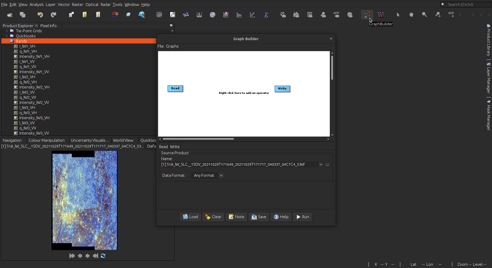
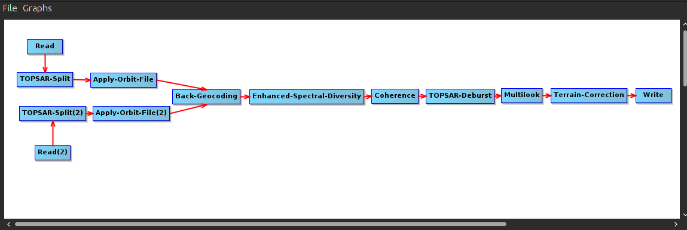
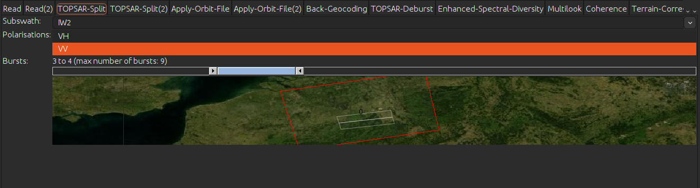
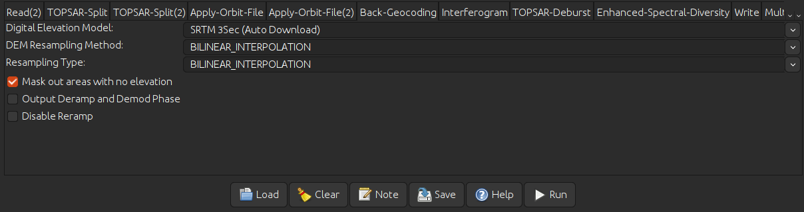
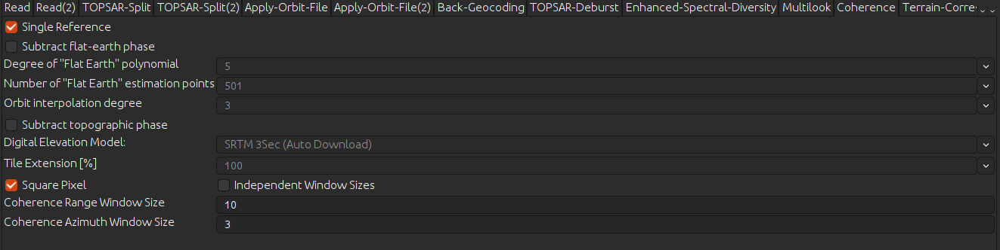
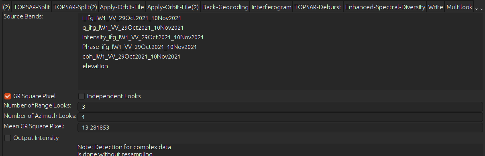
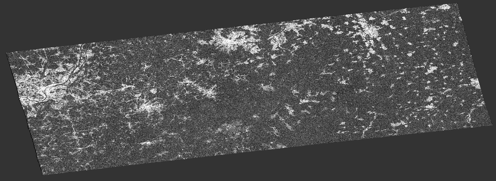
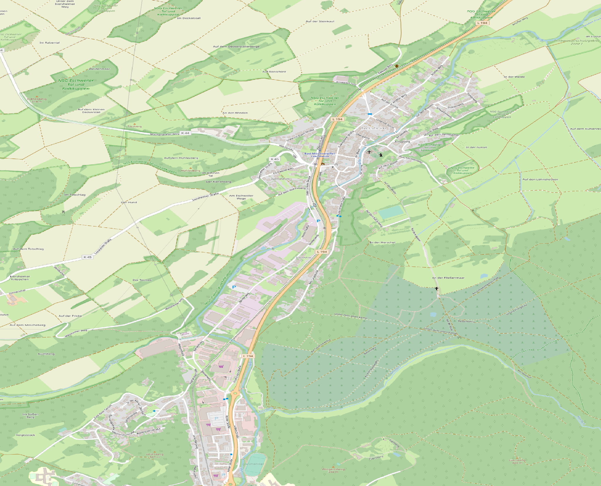
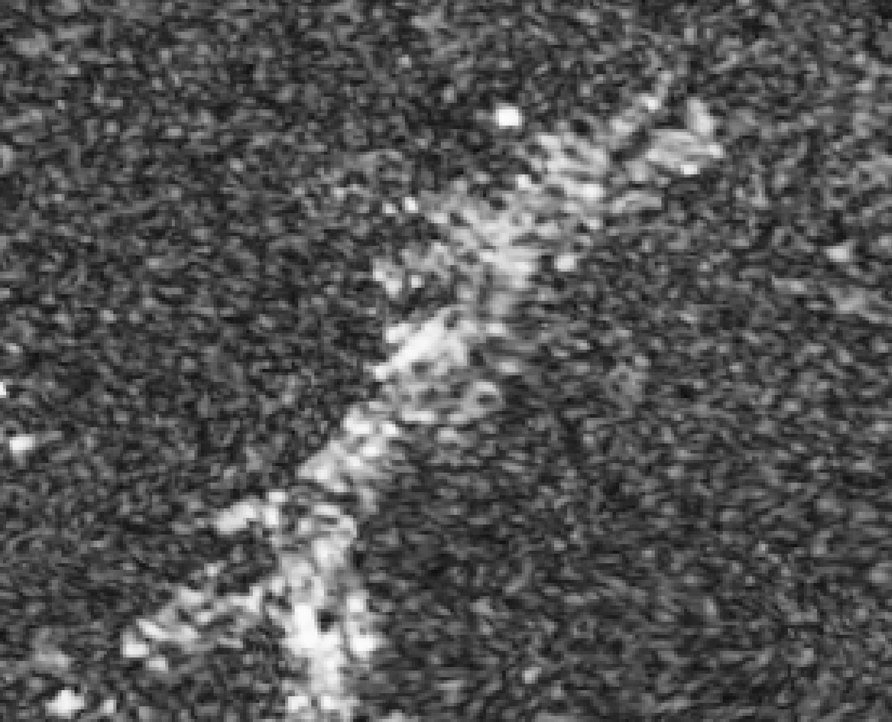
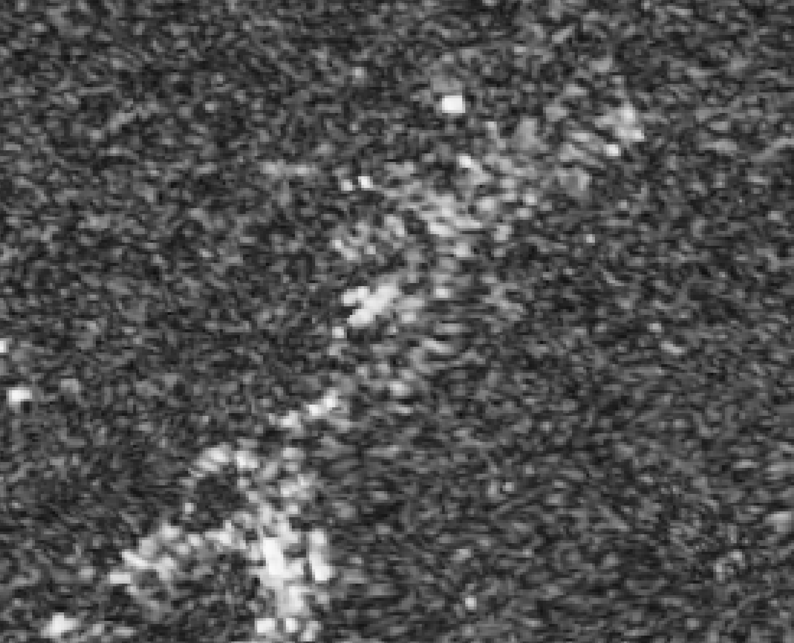

The Earth on AWS project provides Synthetic Aperture Radar (SAR) data from the Sentinel-1 mission in the Single-Look Complex (SLC) format in an uncompressed way. After the retrieval of the scenes from the S3 bucket, the user may proceed with the processing of them to create insightful products such as deformation maps in this case.

## Background

### Coherence change detection

SAR imagery in the SLC format contains information not only about the amplitude of the backscattered signals, but also the phase at the same time. These values are represented as a vector, also the degree of change of this vector over time is called `coherence`. This value is proxy to the Signal to Noise ratio in interferometry, but it can also serve the purpose of a change detection indicator.

### Software
There are a variety of software packages capable of managing SAR data and calculating different products with it suc as change maps, interferograms and displacement maps both in the open source and the private scene. In this case, the software [SNAP](https://step.esa.int/main/download/snap-download/)  from the European Space Agency (ESA) will be used thanks to its user-friendly interface, great utilities with the Sentinel-1 SAR imagery and compatibility with the most common operating systems.

### Doing change detection
In this tutorial a [recipe](./recipes/Sentinel_1_Coherence_CD.xml) was prepared, so the user can get an easy first experience with the technique. This recipe is an end to end workflow that will provide you with a geocoded coherence map. The same result can also be achieved by executing each step separately as well and also all intermediate steps can be saved.

The Sentinel-1 SLC images used in this tutorial are:
- S1A_IW_SLC__1SDV_20210624T172451_20210624T172518_038485_048A9C_A58F.SAFE
- S1A_IW_SLC__1SDV_20210706T172452_20210706T172519_038660_048FE2_0EA3.SAFE
- S1A_IW_SLC__1SDV_20210718T172453_20210718T172520_038835_049522_6648.SAFE

This tutorial will show a coherence product ready to be analyzed. This example will show the coherence drops due to the flooding events in the Nordrhein-Westfalen region in Germany during mid 2021

### Loading the imagery
First, you will need to load the 2 images that will feed the interferogram calculation. You can load imagery by following menu `File > Open Product` or by dragging the imagery folders (denoted by ending in `.SAFE`) into the Product explorer tab. From here you can explore the scenes and see the different components in the raw imaginary datatype as well as the calculated intensity.

### Loading the Change detection recipe
By clicking the Graph builder button, you can access a tool that executes preconfigured routines. From here you can load the recipe provided in this tutorial and proceed with tuning the parameters according to your use case. For the next steps you will see how to configure the recipe for your use case. The first part is to select your images in the read steps.

1. TopSAR split

The very first step of processing consists in selecting the right portion of the image to be processed. This will vary according to your needs and the Area of Interest of your project. You can do this by selecting one of the three main divisions (Swaths) and then using the slider to select the right subdivisions (Bursts). Check if the VV polarisation is selected and provide the same parameters in the split of your second image. 

2. Apply orbit file

For step you can leave the default setup which will make sure that your images will have access to the best orbit parameters possible. This step will allow you to have a good comparison between both images and a proper geocoding.

3. Image alignment (Coregistration)

The following steps (Back-Geocoding and Enhanced-Spectral-Diversity) will allow you to stack both images with sub-pixel accuracy. The back-geocoding makes use of an external digital elevation model (DEM). you can either use the Auto Download options or you can use another one that you might have. As for the rest of parameters, the default values provide good results.

4. Coherence calculation

In this stage the coherence between both images is calculated. This is a value that ranges form 0 to 1, representing how much has the signal vector changed between two timesteps. low values of coherence (typically below 0.5) indicate that the scatters within the same pixel have changed vastly. In the other scenario, the pixel is more consistent withing both measurements. With this in mind, the change detection can happen by setting a threshold to identify significant changes.

5. Deburst

In the Sentinel-1 SLC images, the acquisition is done with bursts that need to be properly stitched to have a continuous image, this stage will do this for you. 

6. Multi-looking
SAR imagery will have a given degree of noise, this noise can be reduced by doing an spatial averaging called multilook, this will output pixels that have the same dimensions and will reduce the amount of noise. You can play around with the amount of Azimuth and Range looks. Beware that high multilooks can bias the coherence towards the high end.

This is the last step in the provided recipe, the next steps will be done manually.

9. Geocoding

Finally, you can make use of the terrain correction that will geocode and account for geometric distortions in the scene. You might choose the Range-Doppler terrain correction or the SAR Simulation terrain correction if the topography is more dynamic in your area of interest. Both operators are found under `Radar > Geometric > Terrain correction`. By selecting your desired output format, you can also load this raster file into any GIS software or any other method you need for your study case.

### Reading coherence

When reading coherence, the main objective is to find drops in this value that reveal big changes in the scattering mechanism of a pixel. In the following figure, a close up of the coherence in the area of Iversheim, Germany is shown for two pairs of dates. Between 24-06-2021 and 06-07-2021, high coherence values (represented by light gray to white colors) are dominated in the urban area, while low coherence remain to be located in the vegetated areas. After this, between 06-07-2021 and 18-07-2021, localized patches of dark pixels (low coherence) appear within the urban area, plus the overall coherence appears to be lower. these are signs of big changes in the surface composition, these might be associated to the flooding events in the area between July 14 and 15 2021.

Sample area (Iversheim, Germany) | Coherence before the event(24-06-2021 - 06-07-2021) |  Coherence during the event (06-07-2021 - 18-07-2021)
:-------------------------------:|:---------------------------------------------------:|:--------------------------------:
          |                              |       

### Sources

- SNAP - ESA Sentinel Application Platform v8.0.0, http://step.esa.int

- S1TBX - ESA Sentinel-1 Toolbox, http://step.esa.int

- After the floods: Germany’s Ahr valley then and now – in pictures, https://www.theguardian.com/world/2022/jul/13/floods-then-and-now-photographs-germany-ahr-valley-flooding-disaster-july-2021